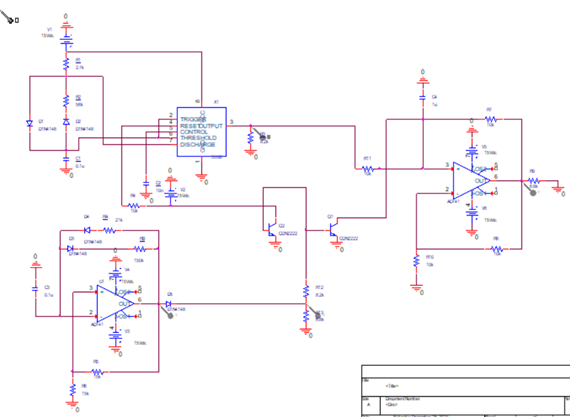
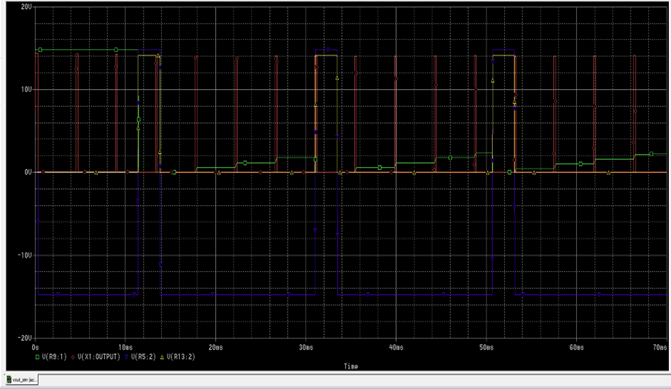
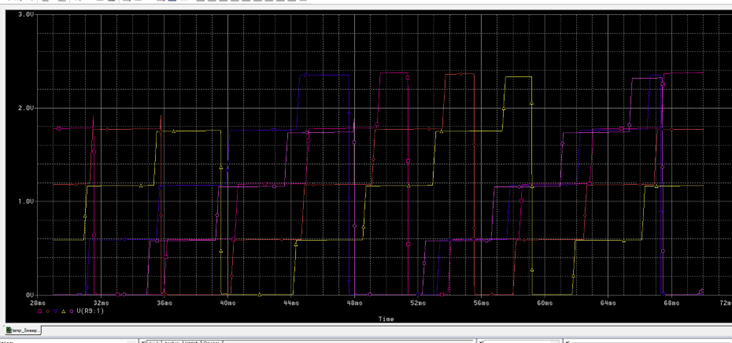

# Electronics III: Analog Circuit Design (ECE AUTh)

This repository hosts the laboratory projects for the Electronics III course. It includes theoretical analysis, SPICE simulations, and experimental validation of advanced analog circuits.

---

## 🟢 Exercise 1: Waveform Generator Design

Design and analysis of a triangular and square wave generator using an astable multivibrator topology (Schmitt Trigger & Inverting Integrator).

### 📐 Circuit & Theory
The circuit utilizes **uA741 Op-Amps** and **1N750 Zener diodes** to generate periodic waveforms.
* **Period:** $T = 4 \cdot R \cdot C \cdot \frac{R_f}{R_1}$
* **Peak Amplitude:** $V_{o,peak} = V_Z \cdot \frac{R_f}{R_1}$

### 📊 Comparative Results
| Parameter | Theoretical | Laboratory | SPICE |
| :--- | :---: | :---: | :---: |
| **Period (T)** | $1.33\text{ ms}$ | $1.50\text{ ms}$ | $1.44\text{ ms}$ |
| **Vout (Peak)** | $7.50\text{ V}$ | $7.00\text{ V}$ | $7.30\text{ V}$ |
| **Slew Rate** | - | $0.313\text{ V/μs}$ | $0.318\text{ V/μs}$ |

#### Visual Validation
| Lab Measurement | SPICE Simulation | High-Freq Distortion |
| :---: | :---: | :---: |
|  |  |  |

### 🚀 Key Findings
* **Frequency Limits:** Identified $f_{max} \approx 2.5\text{ MHz}$. Beyond this, the Slew Rate causes rounding of the square wave (see *High-Freq Distortion* above).
* **Optimization:** Reducing $R_2$ to $1\text{ k}\Omega$ improved the Slew Rate to $0.438\text{ V/μs}$ and boosted $f_{max}$ to $3\text{ MHz}$.
* **Independent Scaling:** Successfully scaled output amplitude from $7.3\text{ V}$ to $10.85\text{ V}$ without affecting frequency by adjusting $V_Z$ and $RC$ values.
---

## 🔵 Exercise 2: Staircase Waveform Generator

Design and implementation of a complex waveform generator combining a **555 Timer** (Astable A), an **Op-Amp Multivibrator** (Astable B), and a **Miller Integrator**.

### 📐 System Components & Design
* **Astable A (Timer 555):** Generates triggering pulses with $T \approx 4.5\text{ ms}$. Independent $t_{on}/t_{off}$ control via steering diodes.
* **Astable B (uA741):** Provides the reset signal for the staircase with $T = 20\text{ ms}$ and $V_{p-p} = 30\text{V}$.
* **Integrator:** Accumulates pulses into $0.6\text{V}$ steps.

### 📊 Performance Analysis
| Stage | Parameter | Target Value | Measured (Lab/Spice) |
| :--- | :--- | :---: | :---: |
| **Astable A** | Period ($T$) | $4.0\text{ ms}$ | $\approx 4.5\text{ ms}$ |
| **Astable B** | Period ($T$) | $19.0\text{ ms}$ | $20.0\text{ ms}$ |
| **Integrator**| Step Height | $0.6\text{ V}$ | Verified |

#### System Synchronization
The following waveforms demonstrate the precise timing between the internal stages ($V_1, V_2, V_3$) and the final staircase output ($V_{out}$):

### 🌡️ Thermal Stability (Temperature Sweep)
We analyzed the circuit's behavior across a wide temperature range ($-20^\circ C$ to $+70^\circ C$):
* **Low Temperatures (-20°C):** Reduced amplitude and delayed oscillation due to lower component conductivity.
* **High Temperatures (+70°C):** Increased instability and frequency fluctuations caused by thermal noise and variations in capacitor/transistor characteristics.
* **Optimal Performance:** Observed at $20^\circ C$, where charging/discharging cycles reached maximum linearity.

## 📂 Repository Structure

* 📂 **[Assignment](./assignment/)**: Original laboratory instructions and specifications (PDF).
* 📂 **[Report](./report/)**: Detailed technical analysis and results for both exercises (PDF).
* 📂 **[Images](./images/)**: High-resolution oscilloscope captures and SPICE plots.

---
*Developed by ECE AUTh students as part of the Electronics III course.*
