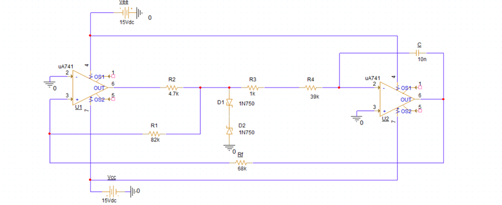
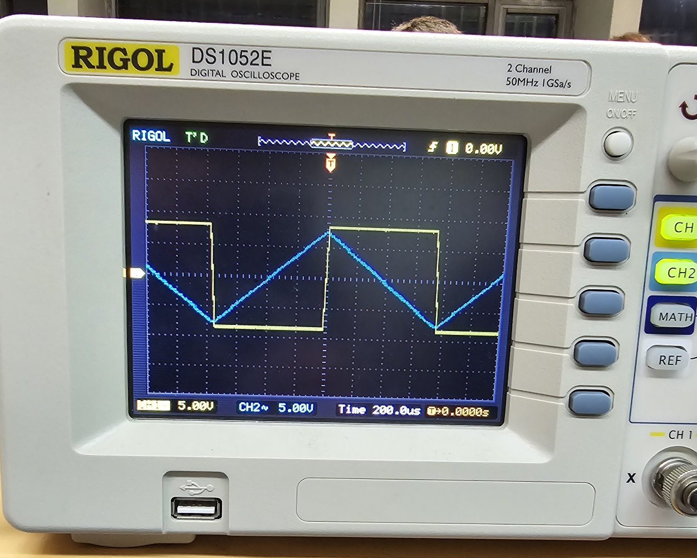
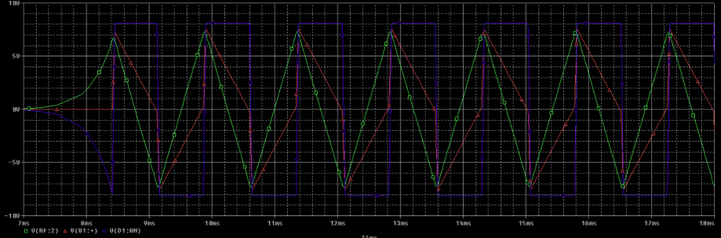
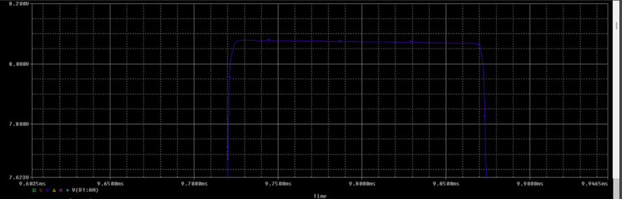

# Electronics III: Analog Circuit Design (ECE AUTh)

This repository hosts the laboratory projects for the Electronics III course. It includes theoretical analysis, SPICE simulations, and experimental validation of advanced analog circuits.

---

## 🟢 Exercise 1: Waveform Generator Design

Design and analysis of a triangular and square wave generator using an astable multivibrator topology (Schmitt Trigger & Inverting Integrator).

### 📐 Circuit & Theory
The circuit utilizes **uA741 Op-Amps** and **1N750 Zener diodes** to generate periodic waveforms.
* **Period:** $T = 4 \cdot R \cdot C \cdot \frac{R_f}{R_1}$
* **Peak Amplitude:** $V_{o,peak} = V_Z \cdot \frac{R_f}{R_1}$

### 📊 Comparative Results
| Parameter | Theoretical | Laboratory | SPICE |
| :--- | :---: | :---: | :---: |
| **Period (T)** | $1.33\text{ ms}$ | $1.50\text{ ms}$ | $1.44\text{ ms}$ |
| **Vout (Peak)** | $7.50\text{ V}$ | $7.00\text{ V}$ | $7.30\text{ V}$ |
| **Slew Rate** | - | $0.313\text{ V/μs}$ | $0.318\text{ V/μs}$ |

#### Visual Validation
| Lab Measurement | SPICE Simulation | High-Freq Distortion |
| :---: | :---: | :---: |
|  |  |  |

### 🚀 Key Findings
* **Frequency Limits:** Identified $f_{max} \approx 2.5\text{ MHz}$. Beyond this, the Slew Rate causes rounding of the square wave (see *High-Freq Distortion* above).
* **Optimization:** Reducing $R_2$ to $1\text{ k}\Omega$ improved the Slew Rate to $0.438\text{ V/μs}$ and boosted $f_{max}$ to $3\text{ MHz}$.
* **Independent Scaling:** Successfully scaled output amplitude from $7.3\text{ V}$ to $10.85\text{ V}$ without affecting frequency by adjusting $V_Z$ and $RC$ values.

---
