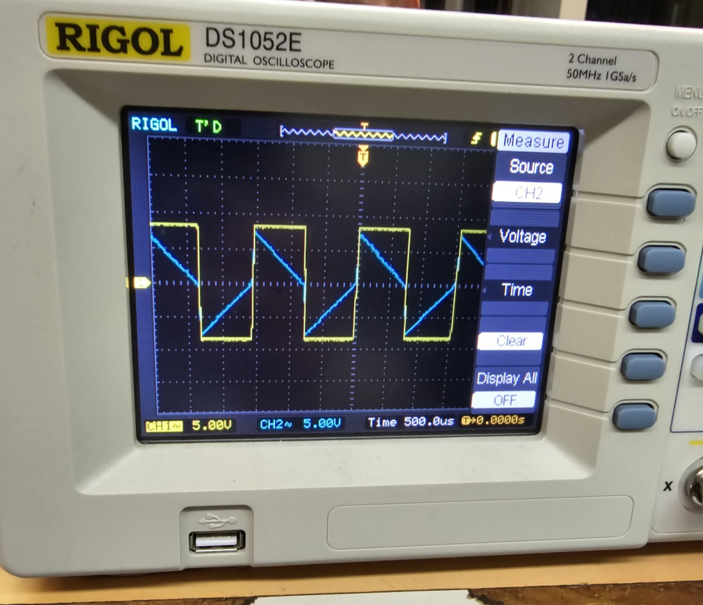

# Electronics III: Waveform Generator Design & Analysis

This repository contains the design, theoretical derivation, and experimental validation of a **Triangular and Square Waveform Generator**. The project was developed as part of the Electronics III Laboratory (ECE AUTh, 7th Semester).

## 📘 Circuit Architecture

The generator is based on an astable multivibrator topology consisting of two primary Operational Amplifier stages:
1.  **Schmitt Trigger (U1):** A comparator with positive feedback that generates the square wave ($V_2$). Clamping Zener diodes (1N750) are used to stabilize the output levels.
2.  **Inverting Integrator (U2):** A stage that integrates the square wave to produce a linear triangular ramp ($V_{out}$).

## 🔍 Theoretical Framework

The circuit's performance is governed by the following analytical relationships:
* **Oscillation Period ($T$):** Derived as $T = 4 \cdot R \cdot C \cdot \frac{R_f}{R_1}$
* **Peak Amplitude:** Determined by the threshold levels $V_{o,peak} = V_Z \cdot \frac{R_f}{R_1}$
* **Threshold Points ($V_1$):** Controlled by the voltage divider $R_1, R_2$ and the Zener breakdown voltage ($V_Z = 7.5V$).

## 📊 Experimental Results & Comparative Study

The project involved a rigorous comparison between theoretical values, laboratory measurements (Oscilloscope), and SPICE simulations.

### 1. Component Setup
* **Capacitance (C):** $10\text{ nF}$
* **Resistors:** $R_1 = 82\text{ k}\Omega$, $R_f = 68\text{ k}\Omega$, $R_2 = 4.7\text{ k}\Omega$, $R = 40\text{ k}\Omega$.

### 2. Performance Metrics Comparison
| Parameter | Theoretical | Laboratory | SPICE Simulation |
| :--- | :--- | :--- | :--- |
| **Period (T)** | $1.33\text{ ms}$ | $1.50\text{ ms}$ | $1.44\text{ ms}$ |
| **Square Wave (V2)** | $8.20\text{ V}$ | $8.00\text{ V}$ | $8.12\text{ V}$ |
| **Triangular (Vout)** | $7.50\text{ V}$ | $7.00\text{ V}$ | $7.30\text{ V}$ |
| **Slew Rate (SR)** | - | $0.313\text{ V/μs}$ | $0.318\text{ V/μs}$ |

#### Visual Verification (Lab vs. SPICE)
| Laboratory Measurement (Oscilloscope) | SPICE Simulation Output |
| :---: | :---: |
|  |  |

*The images above demonstrate the core waveforms ($V_{out}$ and $V_2$). Additionally, the following capture shows the hysteresis levels ($V_1$ vs $V_2$):*

## 🚀 Advanced Parametric Analysis

### High-Frequency Limitations & Slew Rate
Using parametric sweeps in SPICE, we identified the maximum operating frequency ($f_{max}$) before waveform distortion occurs due to the Op-Amp's Slew Rate:
* **Initial Setup:** Identified $f_{max} \approx 2.44\text{ MHz}$ for $R_4 = 7\text{ k}\Omega$.
* **Optimization:** By reducing $R_2$ to $1\text{ k}\Omega$, the circuit achieved a higher $f_{max} \approx 3.00\text{ MHz}$ and an improved Slew Rate of $0.438\text{ V/μs}$.

*The rounding of the square wave edges (V2) at 7kΩ indicates the transition into the slew-rate limited region.*

### Amplitude & Frequency Control
We demonstrated that the output amplitude can be scaled independently of the frequency. By doubling the Zener breakdown voltage ($V_Z$) and proportionally decreasing the $RC$ time constant, we successfully increased the peak amplitude from $7.3\text{ V}$ to $10.85\text{ V}$ while maintaining a constant frequency.

## 📂 Repository Structure
* `Report/`: Full technical report with analytical derivations.
* `Simulation/`: SPICE netlists and parametric sweep results.
* `Images/`: Oscilloscope captures showing phase relationships between $V_1, V_2,$ and $V_{out}$.

---
*Developed by ECE AUTh students as part of the Electronics III course.*
